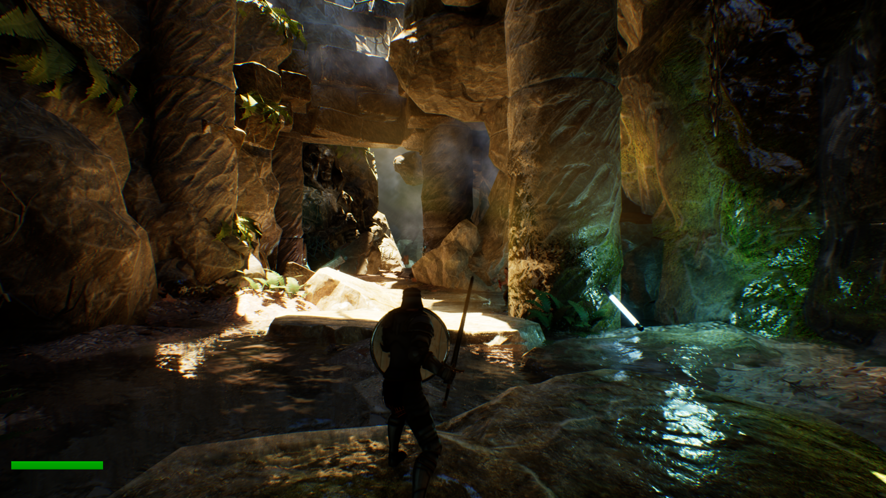
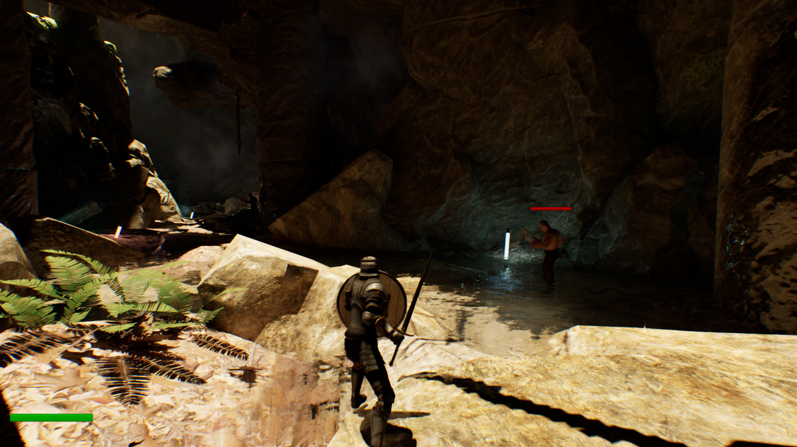

# RPG Game Template Using Unreal Engine 5 and C++
Template is based on [Chris Hall's Udemy course](https://www.udemy.com/course/unreal-engine-5-cpp-your-first-rpg-game/)

## Screenshots

  
  

This repository contains my work from an RPG game development course using Unreal Engine 5.5 and C++. The project was built step by step while following the course and serves as both a learning reference and a portfolio project.

The goal of this project was to gain hands-on experience with Unreal Engine, learn how C++ integrates with gameplay systems, and understand how modern RPG mechanics are built in a real production-style workflow.

## About the Project

During this course, I built an RPG game from the ground up using Unreal Engine 5.5, combining C++ and Blueprints to create scalable and maintainable systems. The project covers a wide range of core game development concepts, from AI and combat systems to UI, animation, and save/load mechanics.

This repository reflects my learning journey and the systems implemented throughout the course.

## What I Learned

- How to build games using Unreal Engine 5.5
- How to write gameplay code using C++
- How C++ integrates with Blueprints
- Implementing enemy AI behavior
- Modern game development workflows and patterns
- Building a User Interface (UI) using UMG
- Writing custom animation notifies in C++
- Creating a custom AI combat system using the Strategy Pattern
- Developing custom components for the Unreal Editor
- Implementing a Save System with checkpoints in C++

## Technologies Used
- Unreal Engine 5.5
- C++
- Blueprints
- AI & Behavior Trees
- Design Patterns (Strategy Pattern)
